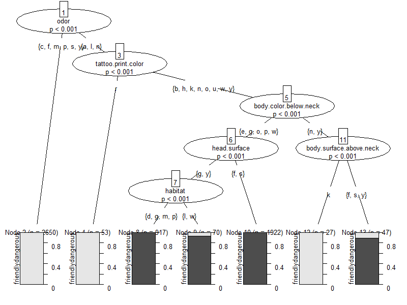

```{r setup, include=FALSE}
knitr::opts_chunk$set(echo = FALSE)
```

## To Trust or Not-to-Trust?

There is no simple rule to determine if someone - or something - is trustworthy. Unlike little ditties for poison ivy like __leaflets three, let it be__, you need to examine multiple features of alien lifeforms to determine if they are friendly or not.

This slide presentation provides the results of predicting the __friendly__ from __dangerous__ Boozonians on planet Hamiltus in the Allen galaxy. Truth be told, the inspiration for this data set is an adaption of the Mushroom Dataset found in the [UCI Mushroom Data Set][1]. There are so many web-based solutions for UCI datasets that the team decided to obscure the data without affecting its underlying predictive value.

The dataset provides 8,123 observations from a plantary probe send prior to mission execution. It contains 21 features. The dataset is fairly balanced, which allows for a more generous environment in applying predictive modeling techniques:

*  friendly lifeforms: 4,208 (51.8%)
* dangerous lifeforms: 3,915 (48.2%)

This deck is written in R Slidy to demonstrate modeling approaches that yield accurate prediction of the data provided into one of two classes. 

Machine learning can keep you alive in use cases of interstellar exploration. Keeping yourself safe from the many other ways of becoming alien-chow is on you.

Good luck, live long and prosper using this model.

## Three classification methods checked

- Classification Tree (less than 1% error)
- Conditional Inference Tree (less than 1% error)
- Random Forest (perfect classifier)

If you had to choose your friends, which ones "work for you?"

## Classification Tree

```{r classTree, echo = FALSE, warning=FALSE, message=FALSE,error=FALSE}

suppressPackageStartupMessages(library(dplyr))
suppressPackageStartupMessages(library(rpart))
suppressPackageStartupMessages(library(rattle))
suppressWarnings(suppressPackageStartupMessages(library(party)))
suppressPackageStartupMessages(library(randomForest))
```

Let's split the data into a 70% training set to do the machine learning and use the other 30% to test the model.

```{r testTrain, echo = TRUE, warning=FALSE, message=FALSE}
alien <- read.csv("./data/mushroomUCI_adapted.csv")

set.seed(524)
train <- sample_frac(alien, 0.7, replace = FALSE)
rows <- as.numeric(row.names(train))
test <- alien[-rows, ]

fit <- rpart(result ~ . , data = train, method = "class")
predicted <- predict(fit, newdata = test, type = "class")
table(predicted, test$result)
```

Not bad...unless **you** meet one of those 11 aliens.

## Classification Tree

```{r prettyPlot, echo = TRUE}
fancyRpartPlot(fit, main = "Alien Lifeform Classification Results",
               sub = "Variable Feature legend is available in the data dictionary")
```

## Conditional Inference Tree
```{r conditional, echo=TRUE, warning=FALSE}
fitC <- ctree(result ~ ., data = train)
table(predict(fitC, newdata = test), test$result)
```

This is a __better__ predictor, but you still have 6 chances to...well... 
             
                         (*_*)  -->  (X_X)

## Conditional Inference Tree
``` {r plot, echo = FALSE, warning = FALSE, include = FALSE}

png("ctree.png", res = 80, height = 600, width = 800) 
   plot(fitC)
dev.off()

```



## Random Forest
``` {r RF, echo = TRUE}

fitRF <- randomForest(result ~ . ,   data = train)
predictedRF <- predict(fitRF, newdata = test, type = "class")
table(predictedRF, test$result)
```
This table shows the results of a random forest model.

In this case, it is a perfect classifier, because of the iterative nature of random forests. 

They are not plotted easily, so this output is the way to determine results.

## Random Forest

...and here are the relative importance of the variables
``` {r imp, echo = FALSE, size = "tiny"}
importance<-as.numeric(importance(fitRF))
variable<-row.names(importance(fitRF))
vars <- as.data.frame(cbind(variable, importance),
                      stringsAsFactors = FALSE)
vars$importance<-as.numeric(vars$importance)
arrange(vars, desc(importance))
```

[1]: https://archive.ics.uci.edu/ml/datasets/Mushroom 