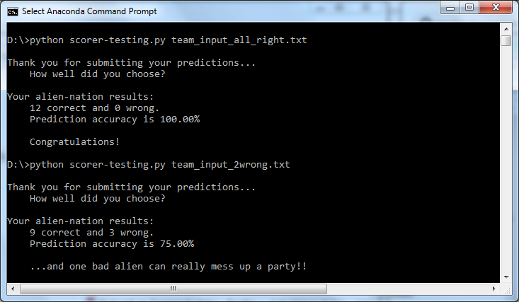

## Unit Test Scorer

This is the prototype version of the scoring script. It allows for "unit testing" with a small set of 12 predictions. The actual script is in a separate folder called [Scoring Script](https://github.com/jgendron/BuildAHackathon/blob/master/Scoring Script/).

There are four files associated with this prototype

* `scorer-testing.py`: is the same as the final but reads in a smaller truth_data file
* `truth_data-testing`: a 12 element answer key for teting various inputs
* `team_input_all_right.txt`: identical to truth data and gives 100% accuracy report
* `team_input_2wrong.txt`: truth data with some UPPER case letters and whitespacing as well as inversion of the first two answers resulting in 83.33% accuracy

You can fool with the last file to test the scoring script.  We can also use the prototype to adjust anything with regard to the console output, then make the final team change in the scoring script.

The team input is simply a text file with the prediction of 12 observations on separate lines. The truth data is this set of 12 results

poison  
edible  
edible  
poison  
edible  
poison  
edible  
poison  
edible  
edible  
edible  
edible  
